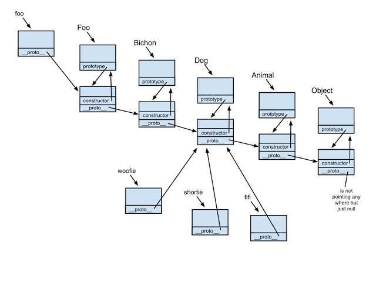

# JS之原型链和继承

## 一、原型链

每个构造函数(constructor)都有一个原型对象(prototype),原型对象都包含一个指向构造函数的指针,而实例(instance)都包含一个指向原型对象的内部指针.

    function Foo(){}
    typeof Foo.prototype // "object"
    
    Foo.prototype = {
      constructor:Foo, // 构造函数指针
      _proto_:Object.prototype // 原型指针
    }

    

- 每个构造函数，都有一个prototype属性，该属性指向一个对象，即原型对象。
- 当使用构造函数创建实例时，对象的原型指针就指向了构造函数的prototype属性对象
- 原型对象都默认有constructor对象，指向它的构造函数，（也就是说构造函数和原型对象是互相指向的关系）。
- 每个对象都有一个隐式的[[prototype]]属性，指向他的原型对象，可以用Object.getPrototypeof(obj)或者obj._proto_来访问
- 构造函数的prototype属性与它创建的实例的[[prototype]]属性指向的对象相同,即obj._proto_ === 函数.prototype 
- 原型对象是用来放实例共有属性
- 在JavaScript中，所有的对象都是由它的原型对象继承而来，反之，所有的对象都可以作为原型对象存在。
- 访问对象的属性时，JavaScript会首先在对象自身的属性内查找，若没有找到，则会跳转到该对象的原型对象中查找。

## 二、如何实现继承？

1. 在Student的构造函数中调用父类的构造方法，实现继承
      
        function Student(x,y,z){
          Person.call(this,x,y)
          this.z = z
        }

2. Student.prototype = Object.create(Person.prototype)
   - 其作用在于创建一个空的对象，并将这个对象的原型对象指向入参对象，即父类的原型，实现继承
   - 可以用以下代码代替
  
         Object.create = function(obj){
            var F = function(){};
            F.prototype = obj;
            return new F();
          }
      或者
         
         Object.create = function(obj){
            var O = {}
            Object.setPrototypeOf(O,obj)
          }
          return O

        或者
         
         Object.create = function(obj){
            var O = {}
            O.__proto__ = obj
          }
          return O
3. 

### 1. 原型链继承
将父类的实例作为子类的原型

    function Parent() {
      this.origin = true
      this.info = {
          name: "default"
      };
    }

    Parent.prototype.getInfo = function() {
      console.log(this.info);
      console.log(this.origin); // true
    }

    function Child() {};
    Child.prototype = new Parent();

    let child1 = new Child();
    child1.info.name = "张三";
    child1.getInfo();  // {name: "张三"}

    let child2 = new Child();
    child2.getInfo();  // {name: "张三"}
    child2.origin = false

    console.log(child1.origin); // true
    console.log(child2.origin); // false

    function Parent(){
      this.info={
        name:'default'
      }
      this.origin=true
    }

    Parent.prototype.getInfo = function(){
      console.log(this.info)
      console.log(this.origin)
    }

    function Child(){}
    Child.prototype=new Parent()

    let child1 = new Child()
    child1.info.name='张三'
    child1.getInfo()

    let child2 = new Child()
    child2.origin=false

    child1.getInfo()
    child2.getInfo()

优点：
- 父类方法可以复用

缺点：
- 父类中的属性是所有子类共享的，但由于引用类型可以说是按引用传递的特性，更改一个子类的引用类型的属性，其他子类也会受影响
- 子类型实例不能给父类型构造函数传参

 

### 2. 盗用构造函数继承(构造函数继承)
在子类构造函数中调用父类构造函数，可以在子类构造函数中使用call()和apply()方法

    function Parent() {
      this.info = {
        name: "yhd",
        age: 19,
      }
    }

    function Child() {
        Parent.call(this)
    }

    let child1 = new Child();
    child1.info.gender = "男";
    console.log(child1.info); // {name: "yhd", age: 19, gender: "男"};

    let child2 = new Child();
    console.log(child2.info); // {name: "yhd", age: 19}

通过使用call()或apply()方法，Parent构造函数在为Child的实例创建的新对象的上下文执行了，就相当于新的Child实例对象上运行了Parent()函数中的所有初始化代码，结果就是每个实例都有自己的info属性。

相比于原型链继承，盗用构造函数的一个优点在于可以在子类构造函数中像父类构造函数传递参数。

    function Parent(name) {
        this.info = { name: name };
    }
    function Child(name) {
        //继承自Parent，并传参
        Parent.call(this, name);
        
        //实例属性
        this.age = 18
    }

    let child1 = new Child("yhd");
    console.log(child1.info.name); // "yhd"
    console.log(child1.age); // 18

    let child2 = new Child("wxb");
    console.log(child2.info.name); // "wxb"
    console.log(child2.age); // 18

在上面例子中，Parent构造函数接收一个name参数，并将他赋值给一个属性，在Child构造函数中调用Parent构造函数时传入这个参数， 实际上会在Child实例上定义name属性。为确保Parent构造函数不会覆盖Child定义的属性，可以在调用父类构造函数之后再给子类实例添加额外的属性

优点：
- 可以在子类构造函数中向父类传参数
- 父类的引用属性不会被共享

缺点：
- 子类不能访问父类原型上定义的方法（即不能访问Parent.prototype上定义的方法），因此所有方法属性都写在构造函数中，每次创建实例都会初始化

 

### 3. 组合继承
组合继承综合了原型链继承和盗用构造函数继承(构造函数继承)，将两者的优点结合了起来，基本的思路就是使用原型链继承原型上的属性和方法，而通过构造函数继承实例属性，这样既可以把方法定义在原型上以实现重用，又可以让每个实例都有自己的属性

    function Parent(name) {
      this.name = name
      this.colors = ["red", "blue", "yellow"]
    }
    Parent.prototype.sayName = function () {
      console.log(this.name);
    }

    function Child(name, age) {
      // 继承父类属性
      Parent.call(this, name)
      this.age = age;
    }
    // 继承父类方法
    Child.prototype = new Parent();

    Child.prototype.sayAge = function () {
      console.log(this.age);
    }

    let child1 = new Child("yhd", 19);
    child1.colors.push("pink");
    console.log(child1.colors); // ["red", "blue", "yellow", "pink"]
    child1.sayAge(); // 19
    child1.sayName(); // "yhd"

    let child2 = new Child("wxb", 30);
    console.log(child2.colors);  // ["red", "blue", "yellow"]
    child2.sayAge(); // 30
    child2.sayName(); // "wxb"

上面例子中，Parent构造函数定义了name，colors两个属性，接着又在他的原型上添加了个sayName()方法。Child构造函数内部调用了Parent构造函数，同时传入了name参数，同时Child.prototype也被赋值为Parent实例，然后又在他的原型上添加了个sayAge()方法。这样就可以创建 child1，child2两个实例，让这两个实例都有自己的属性，包括colors，同时还共享了父类的sayName方法

优点：
- 父类的方法可以复用
- 可以在Child构造函数中向Parent构造函数中传参
- 父类构造函数中的引用属性不会被共享

缺点：

 

### 4. 原型继承
对参数对象的一种浅复制

    function objectCopy(obj) {
      function Fun() { };
      Fun.prototype = obj;
      return new Fun()
    }

    let person = {
      name: "yhd",
      age: 18,
      friends: ["jack", "tom", "rose"],
      sayName:function() {
        console.log(this.name);
      }
    }

    let person1 = objectCopy(person);
    person1.name = "wxb";
    person1.friends.push("lily");
    person1.sayName(); // wxb

    let person2 = objectCopy(person);
    person2.name = "gsr";
    person2.friends.push("kobe");
    person2.sayName(); // "gsr"

    console.log(person.friends); // ["jack", "tom", "rose", "lily", "kobe"]

优点：
- 父类方法可复用

缺点：
- 父类的引用会被所有子类所共享
- 子类实例不能向父类传参

ES5的Object.create()方法在只有第一个参数时，与这里的objectCopy()方法效果相同

 

### 5. 寄生式继承
使用原型式继承对一个目标对象进行浅复制，增强这个浅复制的能力

    function objectCopy(obj) {
      function Fun() { };
      Fun.prototype = obj;
      return new Fun();
    }

    function createAnother(original) {
      let clone = objectCopy(original);
      clone.getName = function () {
        console.log(this.name);
      };
      return clone;
    }

    let person = {
        name: "yhd",
        friends: ["rose", "tom", "jack"]
    }

    let person1 = createAnother(person);
    person1.friends.push("lily");
    console.log(person1.friends);
    person1.getName(); // yhd

    let person2 = createAnother(person);
    console.log(person2.friends); // ["rose", "tom", "jack", "lily"]

优点：

缺点：

 

### 6. 寄生组合继承

    function objectCopy(obj) {
      function Fun() { };
      Fun.prototype = obj;
      return new Fun();
    }

    function inheritPrototype(child, parent) {
      let prototype = objectCopy(parent.prototype); // 创建对象
      prototype.constructor = child; // 增强对象
      Child.prototype = prototype; // 赋值对象
    }

    function Parent(name) {
      this.name = name;
      this.friends = ["rose", "lily", "tom"]
    }

    Parent.prototype.sayName = function () {
      console.log(this.name);
    }

    function Child(name, age) {
      Parent.call(this, name);
      this.age = age;
    }

    inheritPrototype(Child, Parent);
    Child.prototype.sayAge = function () {
      console.log(this.age);
    }

    let child1 = new Child("yhd", 23);
    child1.sayAge(); // 23
    child1.sayName(); // yhd
    child1.friends.push("jack");
    console.log(child1.friends); // ["rose", "lily", "tom", "jack"]

    let child2 = new Child("yl", 22)
    child2.sayAge(); // 22
    child2.sayName(); // yl
    console.log(child2.friends); // ["rose", "lily", "tom"]

优点：
- 只调用一次父类构造函数
- Child可以向Parent传参
- 父类方法可以复用
- 父类的引用属性不会被共享

寄生式组合继承可以算是引用类型继承的最佳模式