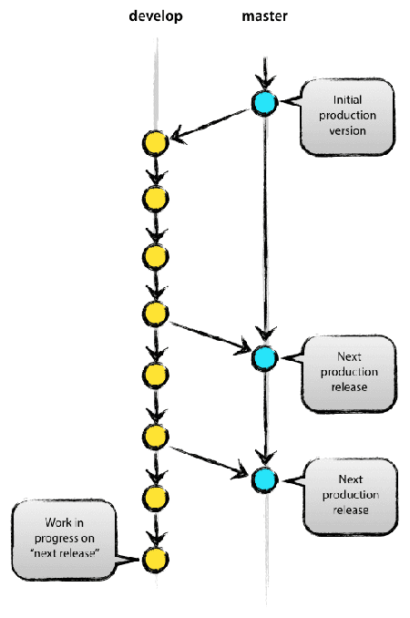

# Git之工作流

之前面试有一家公司的时候，面试官问我，谈谈git工作流的理解，我当时很诧异，觉得这个问题算问题吗，不是规范都清清楚楚，该怎么版就怎么办吗，后来的经历证明是我太年轻了（Doge脸~哈哈），因为确实是发现了有不少团队和公司，有的甚至是大一点的公司，在Git工作流上的相关处理办法和规范的遵守都不够完善，有的甚至是没有规范，当然，对于一些项目只有一个人管理一个代码的地方，我们也没必要强求，但是总归是不利于公司和团队的长期发展，特通过总结此文，期望能让自己对于Git工作流有更清晰的理解和认识，以便和团队分享，推动更加健康的代码管理机制的建设。

### 1. 什么是工作流？

> Git 作为一个源码管理系统，不可避免涉及到多人协作。协作必须有一个规范的工作流程，让大家有效地合作，使得项目井井有条地发展下去。

这样的代码协作工作流程就叫做flow，业界有三种广泛使用的工作流程：

- Git Flow
- Github Flow
- Gitlab Flow

> 以上三种都是“功能驱动开发”，指的是，需求是开发的起点，先有需求再有功能分支（feature branch）或者补丁分支（hotfix branch）。完成开发后，该分支就**合并到主分支，然后被删除**

关于Git的流程规范，可以参考[《Git 使用规范流程》](http://www.ruanyifeng.com/blog/2015/08/git-use-process.html)

### 1.1 Git Flow

- 特点
  - 长期分支：
    - master：对外发布、稳定版
    - develop：日常开发
  - 短期分支：
    - feature：功能分支
    - hotfix：补丁分支
    - release：预发分支

- 优点
  - 清晰可控
- 缺点
  - 基于版本发布，不太适合“持续发布”的工作模式

### 1.2 Github flow

- 特点
  - 长期分支：
    - master
  - 短期分支
    - 按需求从master拉取分支
    - pull request
    - PR接受后合并master并删除

- 优点
  - 最适合“持续发布”
- 缺点
  - 如果线上代码和master代码不一致，比如IOS上架有审核期，或者发布有窗口期，就会造成线上代码落后于master，往往需要新建一个production分支跟踪线上

### 1.3 Gitlab flow

- 特点
  - 对于“持续发布”和版本发布都有不同的处理方式
  - “上游优先”，只有上游分支采纳的代码变化，才能应用到其他分支，就是上游变化了，才能向“下游发展”
  
#### 1.3.1 持续发布

对于不同的环境，有不同的分支
- master ：主分支（上游）
- pre-production ：预发环境（中游）
- production ：生产环境（下游）

比如，生产环境出现了bug，必须由新建一个功能分支，现合并到【上游】master，确认没有问题，再cherry-pick到【中游】pre-production，这一步没问题，再合并到【下游】production。

只有紧急情况，才允许跳过上游，直接合并到下游分支。

（注：cherry-pick，比如A分支想要B分支中的某几个功能，而此时又不能直接合并AB，就将B中的某一个或几个commit，用cherry-pick合并过来，用法：git cherry-pick <commit id>）

#### 1.3.2 版本发布

对于"版本发布"的项目，建议的做法是每一个稳定版本，都要从master分支拉出一个分支，比如2-3-stable、2-4-stable等等。

以后，只有修补bug，才允许将代码合并到这些分支，并且此时要更新小版本号。

## 附录一：参考链接
1. [Git 工作流程](http://www.ruanyifeng.com/blog/2015/12/git-workflow.html)
2. [《Git 使用规范流程》](http://www.ruanyifeng.com/blog/2015/08/git-use-process.html)