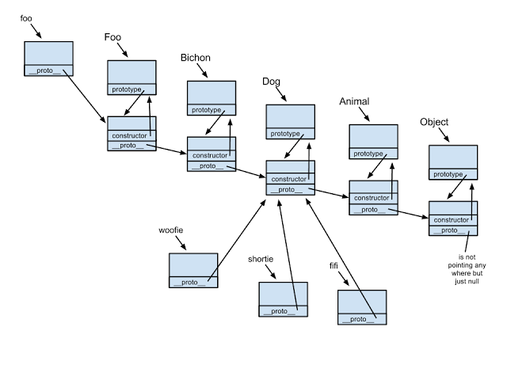

# JS之原型链和继承

每个构造函数(constructor)都有一个原型对象(prototype),原型对象都包含一个指向构造函数的指针,而实例(instance)都包含一个指向原型对象的内部指针.

    function Foo(){}
    typeof Foo.prototype // "object"
    
    Foo.prototype = {
      constructor:Foo, // 构造函数指针
      _proto_:Object.prototype // 原型指针
    }

    

- 每个构造函数，都有一个prototype属性，该属性指向一个对象，即原型对象。
- 当使用构造函数创建实例时，对象的原型指针就指向了构造函数的prototype属性对象
- 原型对象都默认有constructor对象，指向它的构造函数，（也就是说构造函数和原型对象是互相指向的关系）。
- 每个对象都有一个隐式的[[prototype]]属性，指向他的原型对象，可以用Object.getPrototypeof(obj)或者obj._proto_来访问
- 构造函数的prototype属性与它创建的实例的[[prototype]]属性指向的对象相同,即obj._proto_ === 函数.prototype 
- 原型对象是用来放实例共有属性
- 在JavaScript中，所有的对象都是由它的原型对象继承而来，反之，所有的对象都可以作为原型对象存在。
- 访问对象的属性时，JavaScript会首先在对象自身的属性内查找，若没有找到，则会跳转到该对象的原型对象中查找。

## 如何实现继承？

1. 在Student的构造函数中调用父类的构造方法，实现继承
      
        function Student(x,y,z){
          Person.call(this,x,y)
          this.z = z
        }

2. Student.prototype = Object.create(Person.prototype)
   - 其作用在于创建一个空的对象，并将这个对象的原型对象指向入参对象，即父类的原型，实现继承
   - 可以用以下代码代替
  
         Object.create = function(obj){
            var F = function(){};
            F.prototype = obj;
            return new F();
          }
      或者
         
         Object.create = function(obj){
            var O = {}
            Object.setPrototypeOf(O,obj)
          }
          return O

        或者
         
         Object.create = function(obj){
            var O = {}
            O.__proto__ = obj
          }
          return O
3. 
