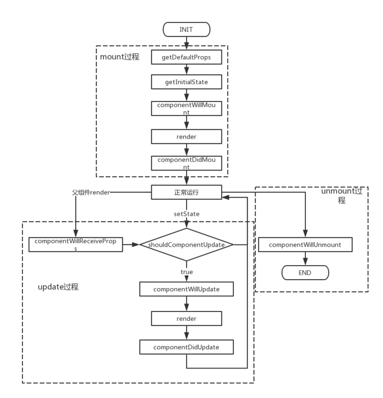

# React系列之React原理浅析

## 一、React 原理要素
- React生命周期
- React JSX
- VirtualDom
- diff

### 1.1 React 生命周期

### 1.2 JSX
> [理解JSX](https://segmentfault.com/a/1190000013870949)
JSX就是语法糖与createElment的写法无异，最后都会通过bable用ATS的编译器解释成JS的createElement的形式

### 1.3 VirtualDom

react 在浏览器端实现了一整套Dom API，开发时所有的Dom构造都是通过虚拟DOM执行，当数据发生变化是，react会重构整个根虚拟Dom（可以理解为一个组件Dom），然后用diff算法比对实际的Dom结构，只更新需要更新的地方。

- 在一次事件循环周期中发生的两次或多次Dom更新会被合并

## 二、React 组件化

与MVC，将开发分为数据、表现、控制三要素不同，react的组件化思想是从开发的功能的角度出发，将UI拆分成一个个独立的组件，组件间相互独立，然后通过小的组件嵌套成为大组件来实现完整UI的构建

react组件化的三个特征：
    - 可复用
    - 可组合
    - 可维护 

## 附录：参考链接
1. [react基本原理及性能优化](https://segmentfault.com/a/1190000015648248)
2. [一看就懂的ReactJs入门教程-精华版](https://www.cnblogs.com/yunfeifei/p/4486125.html)