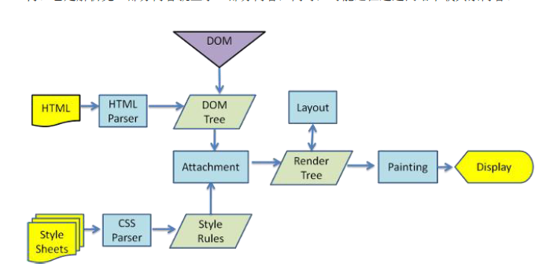
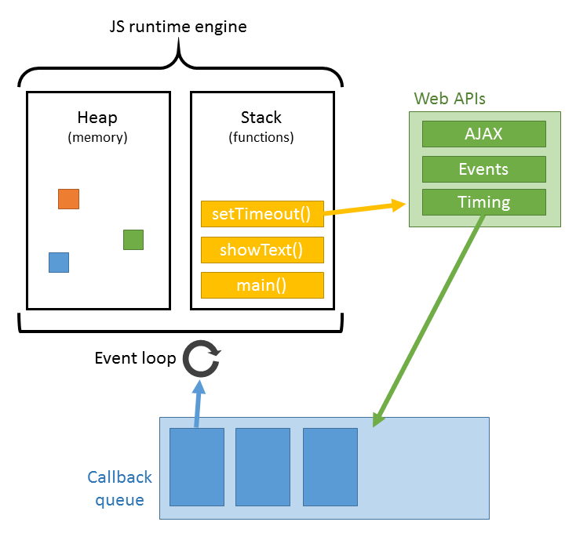

# 浏览器之文档加载和渲染原理

1. 输入URL，发生了什么？
    1. DNS查询，即翻译URL为IP地址
        - DNS多级缓存
        - CDN，即DNS重定向实现负载均衡
    2. TCP连接
        - 三次握手，四次挥手
   
    3. HTTP请求及相应
        - HTTPS:HTTP+SSL或TLS
        - HTTP
          - 请求行
            - 格式为 Method Request-URL HTTP-Version CRLF
          - 请求头
            - Accept 指定客户端用于接受哪些类型的信息
            - Accept-Encoding 指定接受响应信息的编码方式
            - Accept-Language 指定接受响应信息的语言
            - Cache-Control 缓存控制
            - Connection keep-alive标志HTTP请求后不关闭此条TCP连接
            - Cookie 
          - 请求正文
    4. 服务器响应
        - 状态码
          - 1XX 指示信息–表示请求已接收，继续处理
          - 2XX 成功–表示请求已被成功接收、理解、接受
          - 3XX 重定向–要完成请求必须进行更进一步的操作
          - 4XX 客户端错误–请求有语法错误或请求无法实现
          - 5XX 服务器端错误–服务器未能实现合法的请求
        - 响应报头
        - 响应报文
    5. 客户端渲染
        1. 解析HTML文件，构建 **DOM树**
        2. 解析CSS文件，构建 **层叠样式表模型CSSOM**
        3. 组合 **DOM树** 和 **层叠样式表模型CSSOM** 形成 **渲染树**
        4. 布局flow/重布局reflow，此时的RenderObject树并不包含位置和大小信息，webkit将进行布局计算，也就是说确定每个元素的位置、层叠关系等，如果样式发生变化，需要重新计算布局，这很耗费性能；
        5. 绘制paint/重绘repaint，例如当这些元素的颜色、背景等发生变化时，需要重新绘制一遍;
        6. 网页展现在屏幕上

        

    6. 关于JS文件的加载和执行
        1. JSRunTime引擎运行机制
        
        2. JS加载和HTML的渲染是并行的，并不会阻塞HTML的渲染
        3. JS加载后会立即执行，的执行会阻塞渲染
        4. defer、async标志着加载后延迟到页面解析完成后再执行
            - defer IE用的，多个defer能保证按照其出现的顺序执行
            - async H5新特性，无法保证加载顺序

2. 参考链接
    1. [从面试题“输入URL...发生了什么?”学到的(上)](https://wuxinhua.com/2017/10/13/What-happen-from-input-the-URL-in-the-browser-to-the-page-bring-out/)
    2. [前端经典面试题: 从输入URL到页面加载发生了什么？](https://segmentfault.com/a/1190000006879700)

      